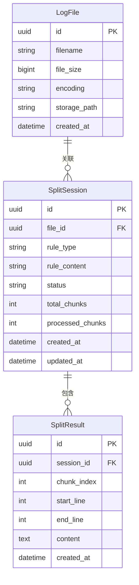
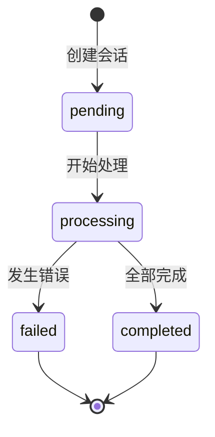

# Data Model: 日志文件切分

**Branch**: `001-log-split`
**Date**: 2026-04-10

## 实体关系图

## 实体详细说明

### LogFile

| 字段 | 类型 | 约束 | 说明 |
|------|------|------|------|
| id | UUID | PK | 唯一标识 |
| filename | VARCHAR(255) | NOT NULL | 原始文件名 |
| file_size | BIGINT | NOT NULL | 文件大小（字节） |
| encoding | VARCHAR(32) | NOT NULL, DEFAULT 'utf-8' | 文件编码 |
| storage_path | VARCHAR(512) | NOT NULL | 存储路径 |
| created_at | TIMESTAMP | NOT NULL | 创建时间 |

### SplitSession

| 字段 | 类型 | 约束 | 说明 |
|------|------|------|------|
| id | UUID | PK | 唯一标识 |
| file_id | UUID | FK -> LogFile.id | 关联文件 |
| rule_type | VARCHAR(32) | NOT NULL | 规则类型: regex/fixed_string |
| rule_content | TEXT | NOT NULL | 规则内容 |
| status | VARCHAR(16) | NOT NULL | 状态: pending/processing/completed/failed |
| total_chunks | INT | DEFAULT 0 | 总片段数 |
| processed_chunks | INT | DEFAULT 0 | 已处理片段数 |
| created_at | TIMESTAMP | NOT NULL | 创建时间 |
| updated_at | TIMESTAMP | NOT NULL | 更新时间 |

### SplitResult

| 字段 | 类型 | 约束 | 说明 |
|------|------|------|------|
| id | UUID | PK | 唯一标识 |
| session_id | UUID | FK -> SplitSession.id | 关联会话 |
| chunk_index | INT | NOT NULL | 片段序号 |
| start_line | INT | NOT NULL | 起始行号 |
| end_line | INT | NOT NULL | 结束行号 |
| content | TEXT | NOT NULL | 片段内容 |
| created_at | TIMESTAMP | NOT NULL | 创建时间 |

## 状态转换

### SplitSession 状态机

## 索引设计

| 表 | 索引字段 | 类型 | 用途 |
|----|----------|------|------|
| SplitSession | file_id | B-tree | 查找某文件的所有会话 |
| SplitSession | status | B-tree | 查找某状态的所有会话 |
| SplitResult | session_id | B-tree | 查找某会话的所有结果 |
| SplitResult | (session_id, chunk_index) | B-tree | 有序获取结果 |

## 验证规则

- LogFile.filename: 非空，最大255字符
- LogFile.file_size: 正整数，最大约2GB
- LogFile.encoding: 必须是支持的编码（utf-8, gbk, gb2312, iso-8859-1等）
- SplitSession.rule_type: 枚举值 'regex' 或 'fixed_string'
- SplitSession.status: 枚举值 'pending', 'processing', 'completed', 'failed'
- SplitResult.chunk_index: 正整数
- SplitResult.content: 单个片段不超过1MB
