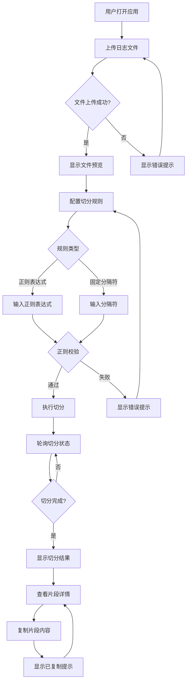
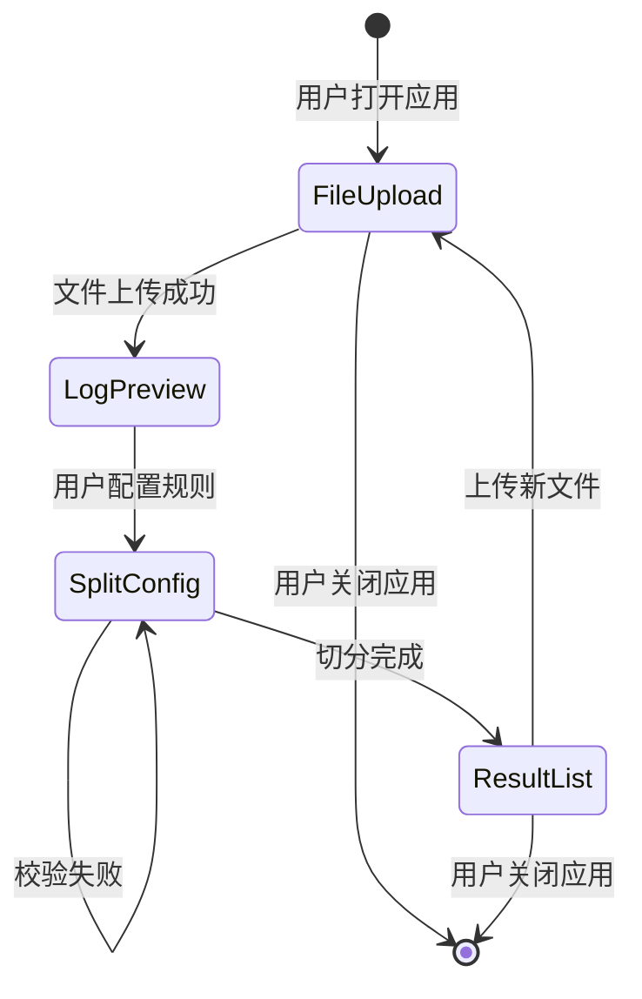
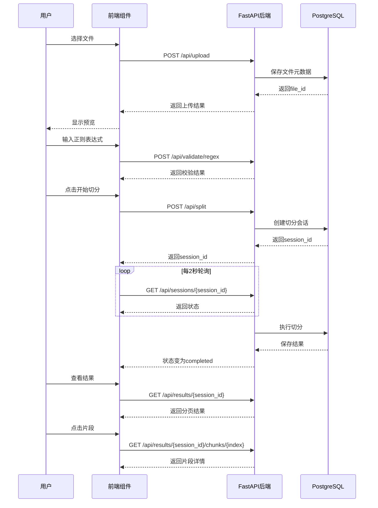
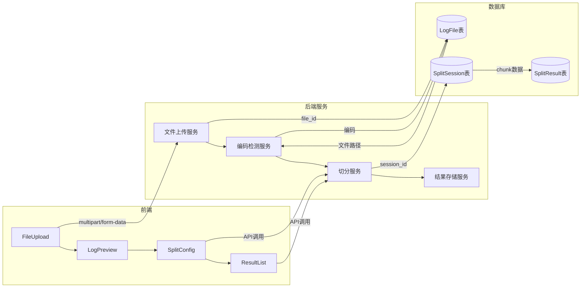
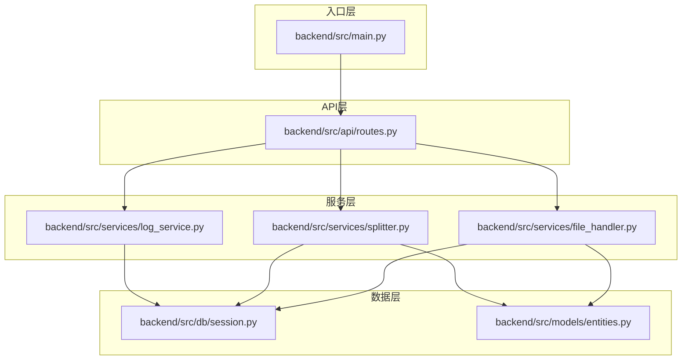
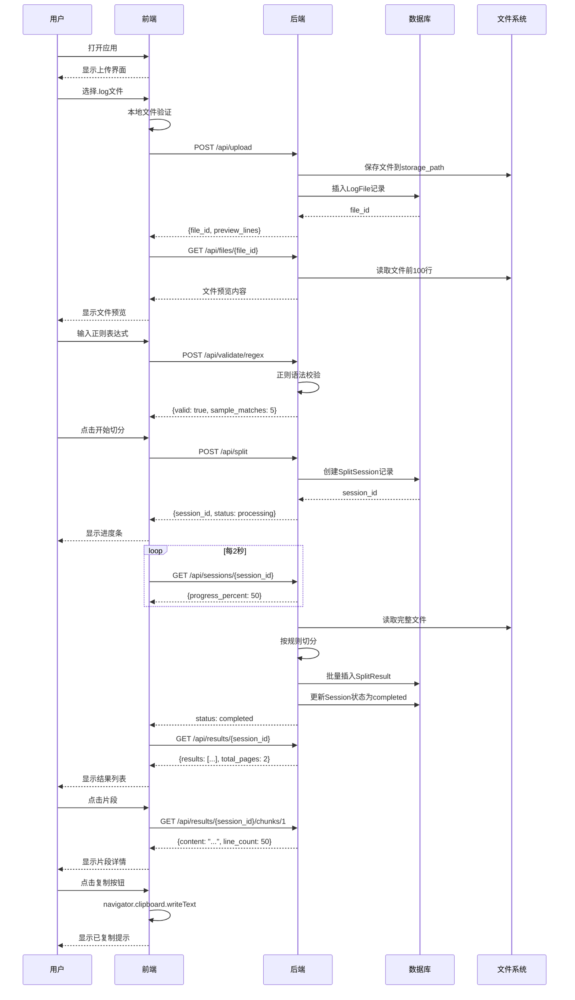

# 代码执行流程图：日志文件切分

**Feature**: `001-log-split`
**Date**: 2026-04-10

> 根据宪法 VII. 代码执行流程图 要求，必须使用 Mermaid 语法绘制流程图，所有文字内容必须使用中文。

## 1. 用户交互流程

## 2. 前端组件状态转换

## 3. API 请求响应链

## 4. 数据流

## 5. 核心模块依赖关系

## 6. 用户完整操作时序

