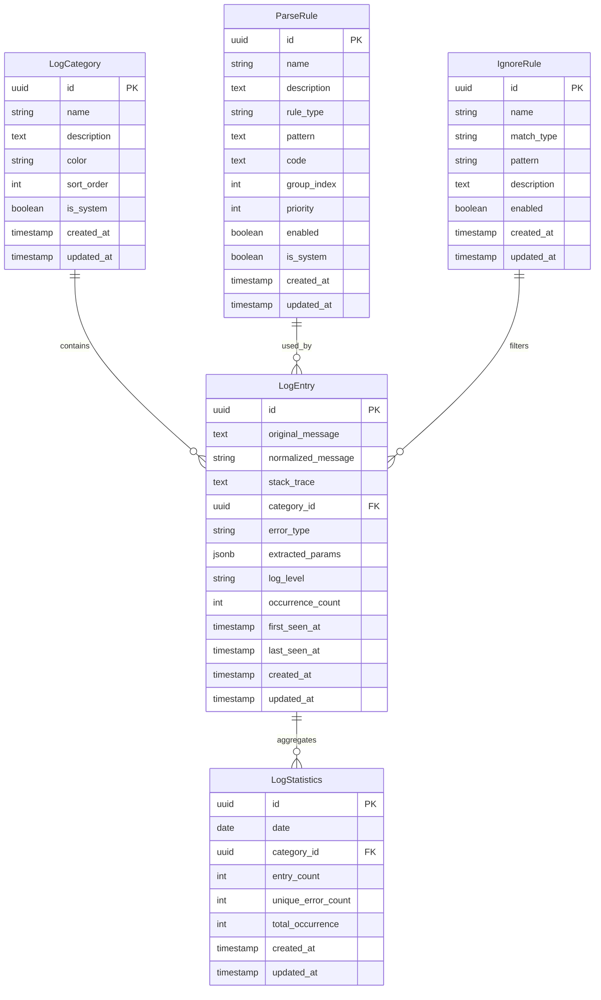

# Flow: 日志分类与结构化存储

**Branch**: `002-short-name-structured`
**Date**: 2026-04-11

## 流程图

### 日志分类与存储流程

```mermaid
flow TD
    A[开始] --> B[接收日志数据]
    B --> C{检查忽略规则}
    C -->|匹配| D[跳过日志]
    C -->|不匹配| E{处理模式}
    E -->|规则引擎| F[规则引擎分类]
    E -->|AI模式| G[AI分析分类]
    F --> H{去重检查}
    G --> H
    H -->|新记录| I[创建LogEntry]
    H -->|重复| J[更新occurrence_count]
    I --> K[更新统计信息]
    J --> K
    D --> L[结束]
    K --> L
```

### 规则引擎处理流程

```mermaid
flow TD
    A[日志输入] --> B[按优先级排序规则]
    B --> C{还有未处理规则?}
    C -->|是| D[取下一条规则]
    D --> E{规则类型}
    E -->|regex| F[正则匹配]
    E -->|code| G[执行代码片段]
    F --> H{匹配成功?}
    G --> H
    H -->|是| I[提取参数]
    H -->|否| C
    I --> J[返回分类结果]
    J --> K[归一化消息]
    K --> L[计算哈希]
    L --> M[去重流程]
    C -->|否| N[返回未分类]
```

### AI模式处理流程

```mermaid
flow TD
    A[日志输入] --> B[构建Prompt]
    B --> C[调用MiniMax API]
    C --> D{API响应正常?}
    D -->|是| E[解析JSON响应]
    D -->|否| F[返回错误]
    E --> G[提取分类结果]
    G --> H[提取去重分组]
    H --> I[更新数据库]
    F --> J[降级到规则引擎]
    J --> K[记录AI错误日志]
    K --> L[继续处理]
```

### 用户交互流程

```mermaid
flow TD
    A[用户上传日志文件] --> B[系统切分日志]
    B --> C[用户触发分类]
    C --> D[系统处理中...]
    D --> E[展示分类结果]
    E --> F{用户操作}
    F -->|查看详情| G[展示日志详情]
    F -->|搜索过滤| H[展示过滤结果]
    F -->|配置规则| I[进入规则管理]
    F -->|配置忽略| J[进入忽略规则]
    G --> K[返回结果列表]
    H --> K
    I --> K
    J --> K
```

### 数据模型关系



### 错误处理流程

```mermaid
flow TD
    A[发生错误] --> B{错误类型}
    B -->|数据库错误| C[记录错误日志]
    B -->|规则执行错误| D[跳过当前规则]
    B -->|AI服务错误| E[降级到规则引擎]
    B -->|输入验证错误| F[返回400错误]
    C --> G[继续处理下一条]
    D --> G
    E --> G
    F --> H[结束]
    G --> H
```
