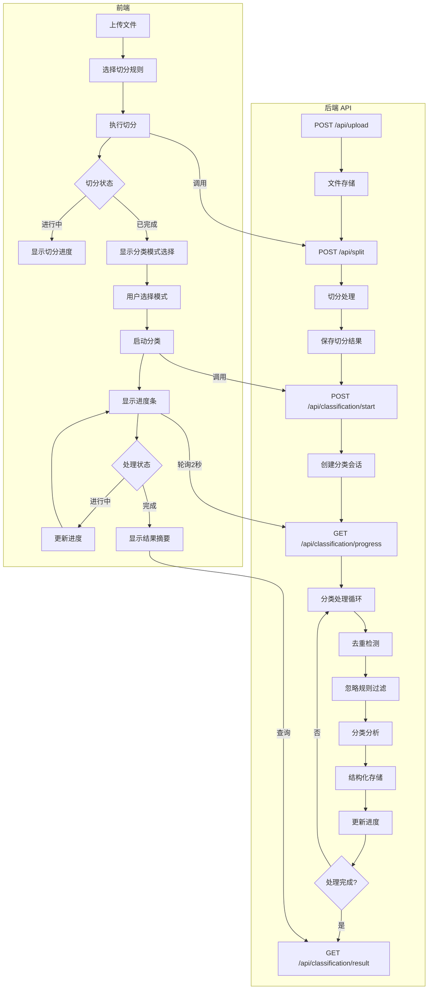
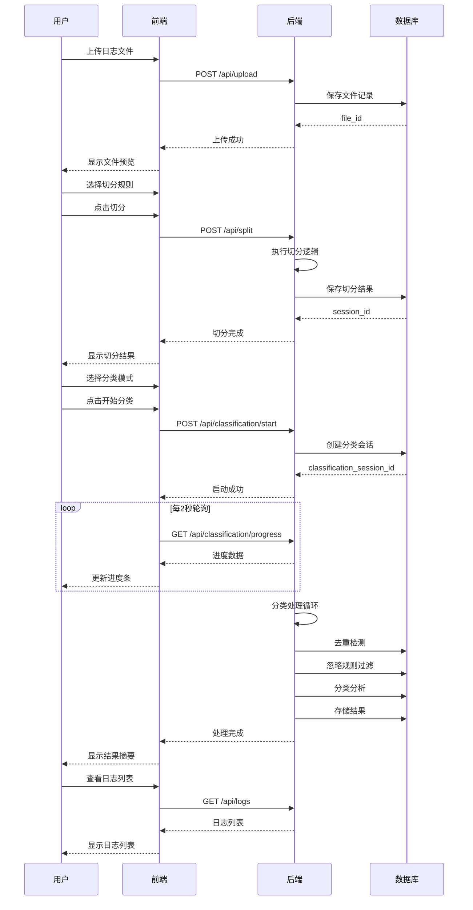
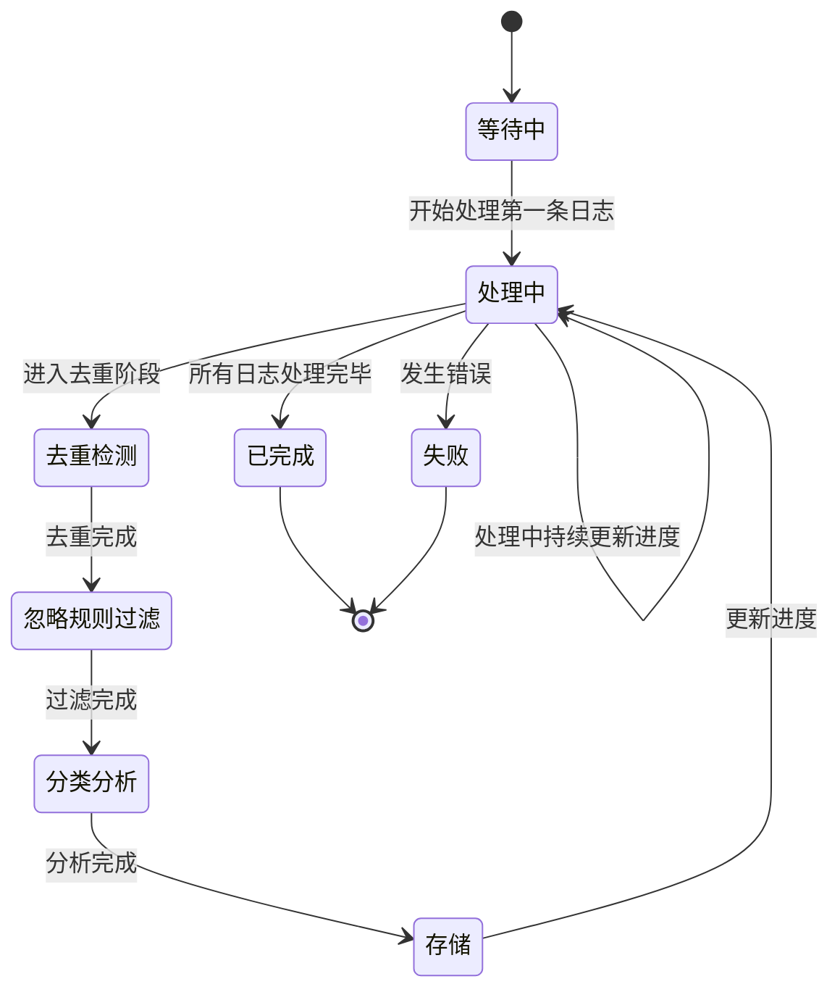
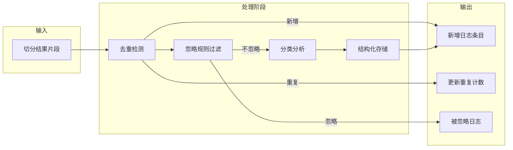
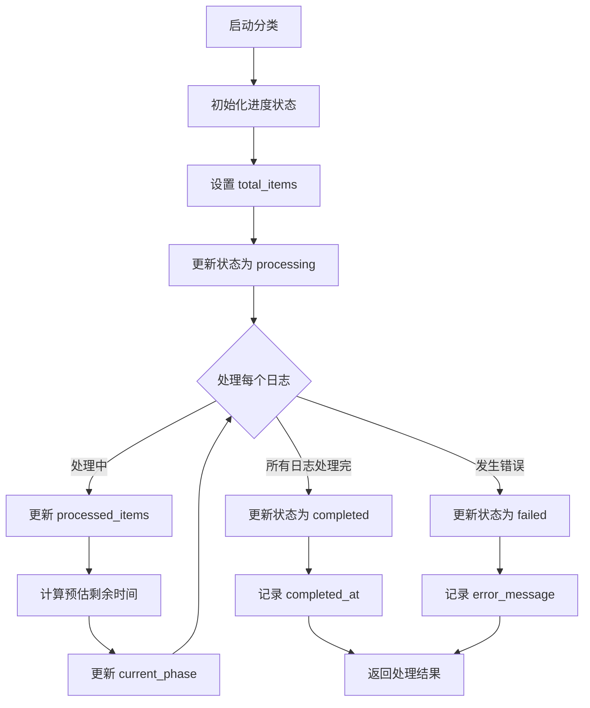
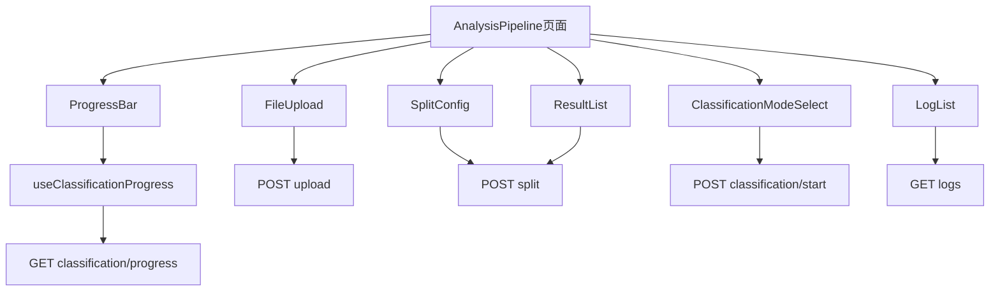
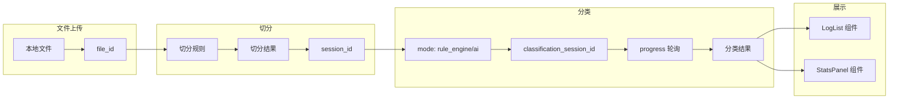
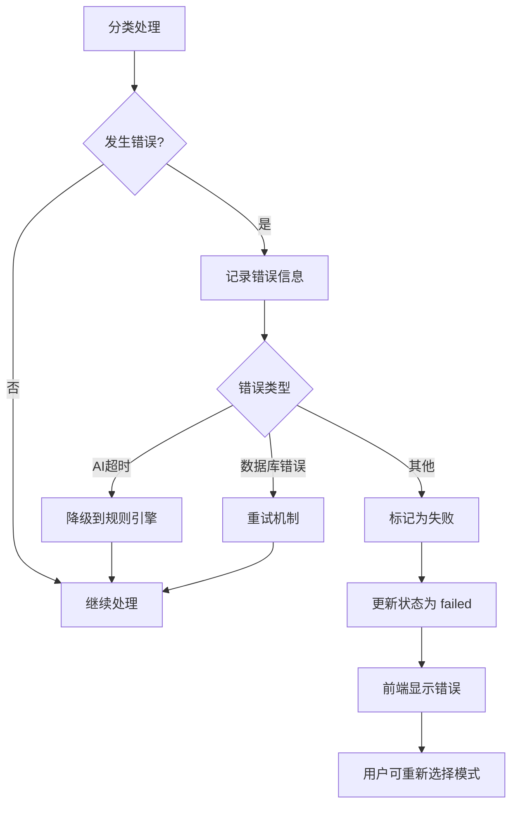
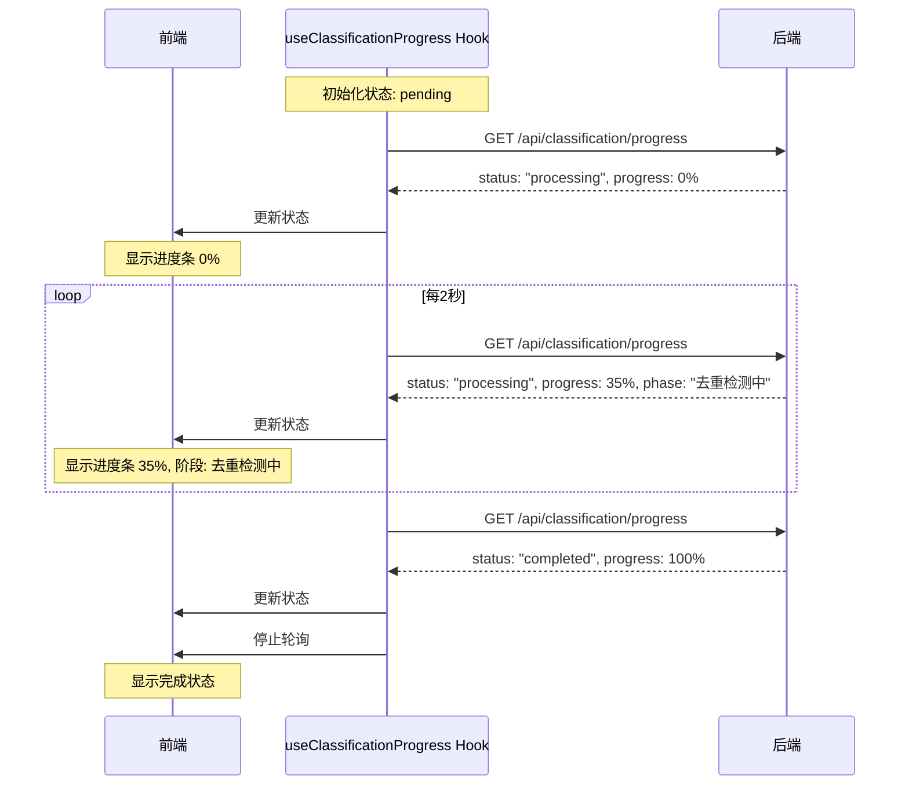

# 代码执行流程图: 日志分析完整流程集成

**Feature**: 003-log-analysis-pipeline
**Created**: 2026-04-11

## 整体流程概览

## 用户故事 1: 完整日志分析流程

## 用户故事 2.1: 后台处理进度显示

## 分类处理内部流程

## 进度跟踪流程

## 前端组件交互流程

## 关键数据流

## 错误处理流程

## 进度更新时序

