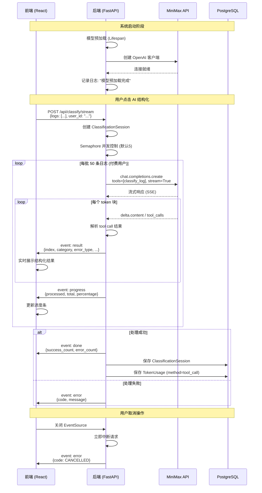
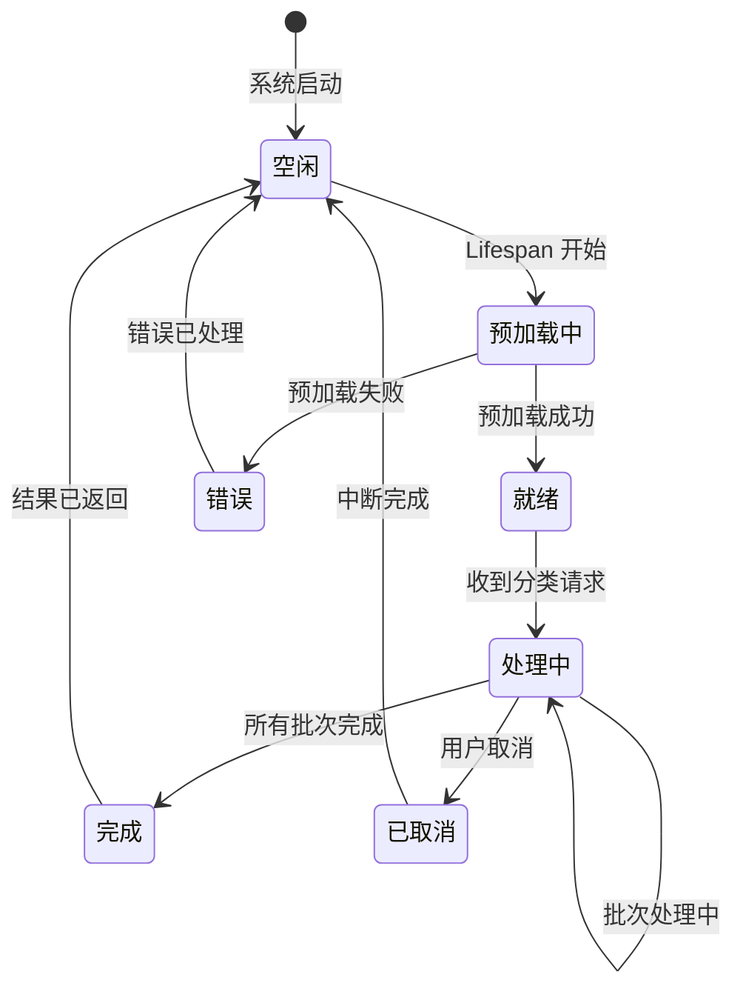
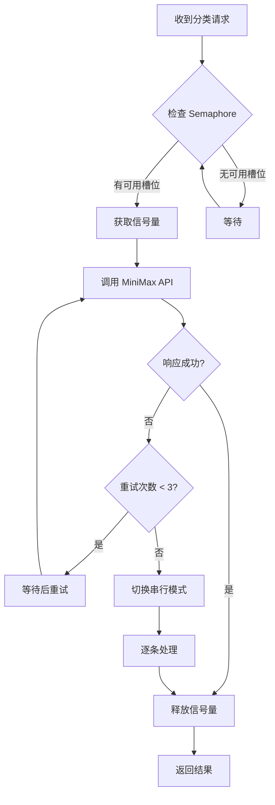
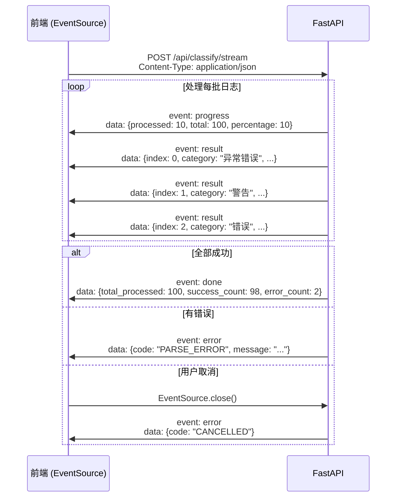
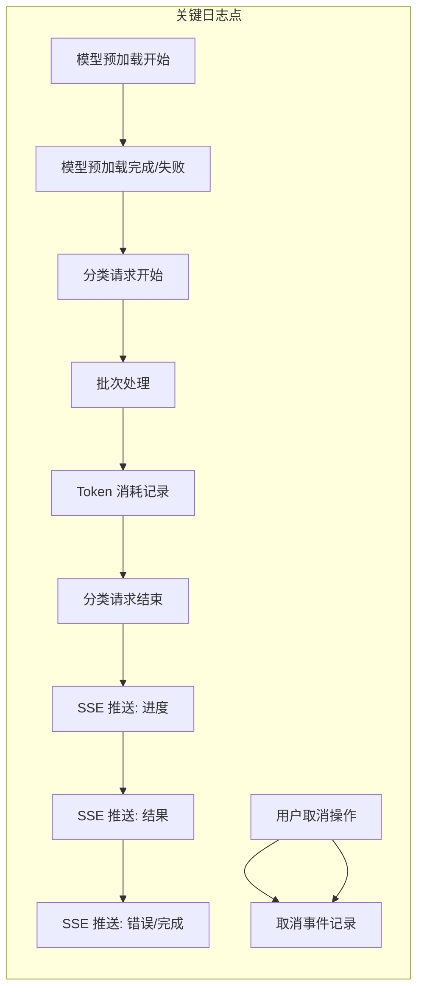

# Flow: AI 结构化工具调用与流式输出优化

**Branch**: `004-ai-tool-call-streaming`
**Date**: 2026-04-11

## 系统架构流程图

```mermaid
sequenceDiagram
    participant 前端 as 前端 (React)
    participant 后端 as 后端 (FastAPI)
    participant MiniMax as MiniMax API
    participant DB as PostgreSQL

    Note over 前端,DB: 系统启动阶段
    后端->>后端: 模型预加载 (Lifespan)
    后端->>MiniMax: 创建 OpenAI 客户端
    MiniMax-->>后端: 连接就绪
    后端->>后端: 记录日志: "模型预加载完成"

    Note over 前端,DB: 用户点击 AI 结构化
    前端->>后端: POST /api/classify/stream<br/>{logs: [...], user_id: "..."}
    后端->>后端: 创建 ClassificationSession
    后端->>后端: Semaphore 并发控制 (默认5)

    loop 每批 50 条日志 (付费用户)
        后端->>MiniMax: chat.completions.create<br/>tools=[classify_log], stream=True
        MiniMax-->>后端: 流式响应 (SSE)

        loop 每个 token 块
            MiniMax-->>后端: delta.content / tool_calls
            后端->>后端: 解析 tool call 结果
            后端->>前端: event: result<br/>{index, category, error_type, ...}
            前端->>前端: 实时展示结构化结果
        end

        后端->>前端: event: progress<br/>{processed, total, percentage}
        前端->>前端: 更新进度条
    end

    alt 处理成功
        后端->>前端: event: done<br/>{success_count, error_count}
        后端->>DB: 保存 ClassificationSession
        后端->>DB: 保存 TokenUsage (method=tool_call)
    else 处理失败
        后端->>前端: event: error<br/>{code, message}
    end

    Note over 前端,DB: 用户取消操作
    前端->>后端: 关闭 EventSource
    后端->>后端: 立即中断请求
    后端->>前端: event: error<br/>{code: CANCELLED}
```

---

## 状态转换流程图

```mermaid
stateDiagram-v2
    [*] --> 空闲: 系统启动

    空闲 --> 预加载中: Lifespan 开始
    预加载中 --> 就绪: 预加载成功
    预加载中 --> 错误: 预加载失败

    就绪 --> 处理中: 收到分类请求
    处理中 --> 处理中: 批次处理中
    处理中 --> 完成: 所有批次完成
    处理中 --> 已取消: 用户取消

    完成 --> 空闲: 结果已返回
    已取消 --> 空闲: 中断完成
    错误 --> 空闲: 错误已处理
```

---

## 并发控制流程图

```mermaid
flowchart TD
    A[收到分类请求] --> B{检查 Semaphore}
    B -->|有可用槽位| C[获取信号量]
    C --> D[调用 MiniMax API]
    D --> E{响应成功?}
    E -->|是| F[释放信号量]
    E -->|否| G{重试次数 < 3?}
    G -->|是| H[等待后重试]
    H --> D
    G -->|否| I[切换串行模式]
    I --> J[逐条处理]
    J --> F
    F --> K[返回结果]

    B -->|无可用槽位| L[等待]
    L --> B
```

---

## SSE 事件流图

```mermaid
sequenceDiagram
    participant 客户端 as 前端 (EventSource)
    participant 服务器 as FastAPI

    客户端->>服务器: POST /api/classify/stream<br/>Content-Type: application/json

    loop 处理每批日志
        服务器->>客户端: event: progress<br/>data: {processed: 10, total: 100, percentage: 10}

        服务器->>客户端: event: result<br/>data: {index: 0, category: "异常错误", ...}
        服务器->>客户端: event: result<br/>data: {index: 1, category: "警告", ...}
        服务器->>客户端: event: result<br/>data: {index: 2, category: "错误", ...}
    end

    alt 全部成功
        服务器->>客户端: event: done<br/>data: {total_processed: 100, success_count: 98, error_count: 2}
    else 有错误
        服务器->>客户端: event: error<br/>data: {code: "PARSE_ERROR", message: "..."}
    else 用户取消
        客户端->>服务器: EventSource.close()
        服务器->>客户端: event: error<br/>data: {code: "CANCELLED"}
    end
```

---

## 日志记录时机

```mermaid
flowchart LR
    subgraph 关键日志点
        A1[模型预加载开始] --> A2[模型预加载完成/失败]
        B1[分类请求开始] --> B2[批次处理]
        B2 --> B3[Token 消耗记录]
        B3 --> B4[分类请求结束]
        C1[SSE 推送: 进度] --> C2[SSE 推送: 结果]
        C2 --> C3[SSE 推送: 错误/完成]
        D1[用户取消操作] --> D2[取消事件记录]
    end

    A2 --> B1
    B4 --> C1
    D1 --> D2
```
