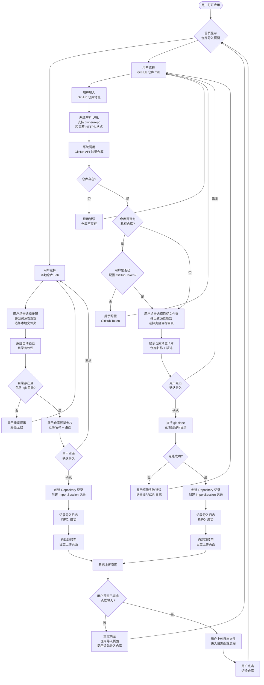
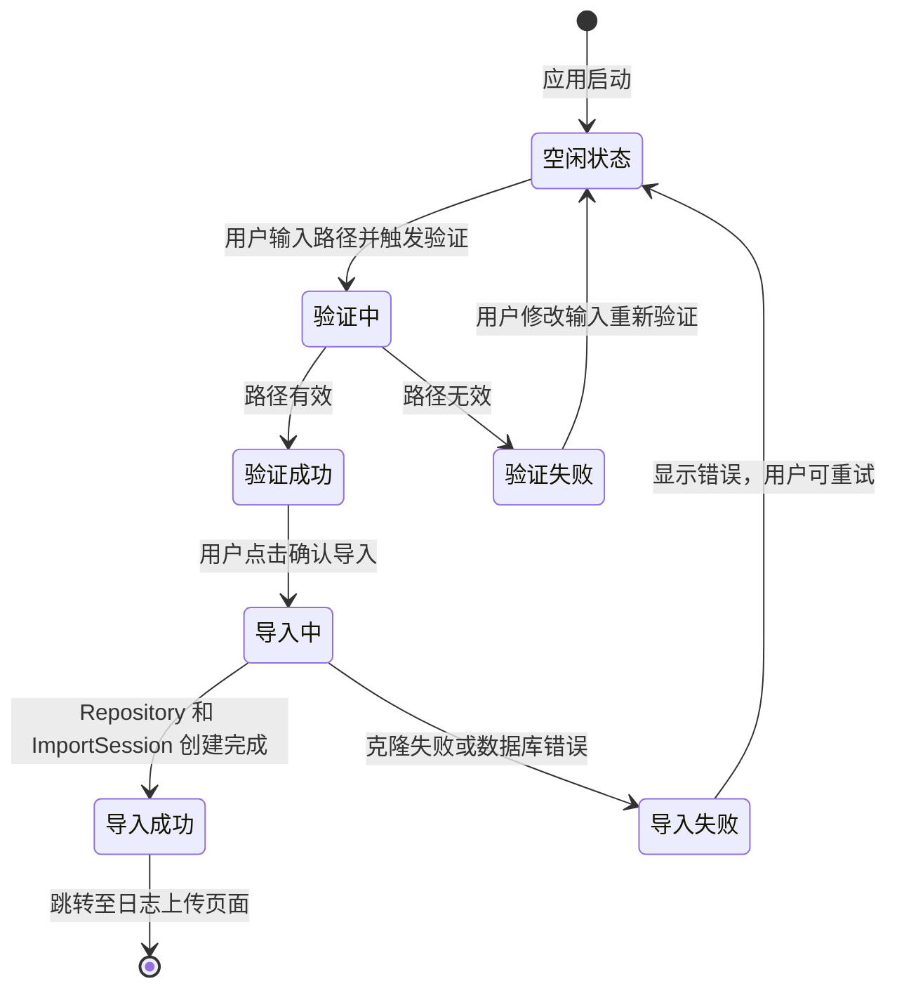
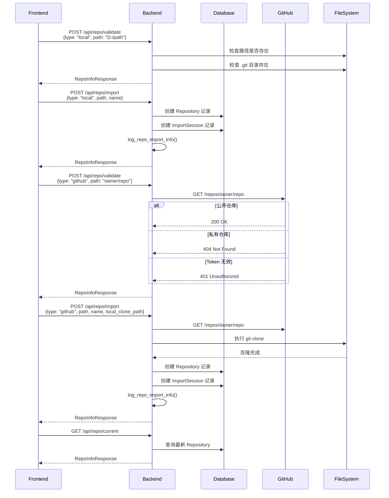
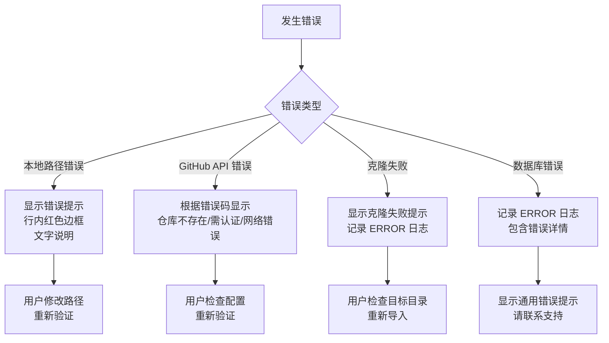

# Flow: 仓库导入功能

**Branch**: `006-repo-import` | **Date**: 2026-04-12

## 用户流程

---

## 状态转换

### 仓库导入状态

---

## API 调用流程

---

## 错误处理流程

---

## 关键日志埋点

| 操作 | 日志级别 | 埋点 | 内容 |
|------|----------|------|------|
| 本地仓库验证成功 | INFO | OBS-001 | source_type=local, local_path, status=success |
| 本地仓库验证失败 | ERROR | OBS-002 | source_type=local, local_path, error=具体错误 |
| GitHub 仓库验证成功 | INFO | OBS-001 | source_type=github, remote_url, status=success |
| GitHub 仓库验证失败 | ERROR | OBS-002 | source_type=github, remote_url, error=具体错误 |
| 仓库导入成功 | INFO | OBS-001 | repo_id, source_type, local_path, status=success |
| 仓库导入失败 | ERROR | OBS-002 | repo_id=null, source_type, remote_url, error=具体错误 |
