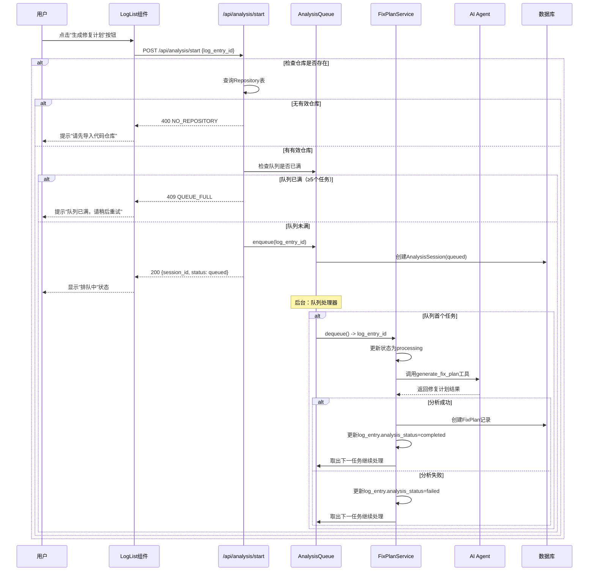
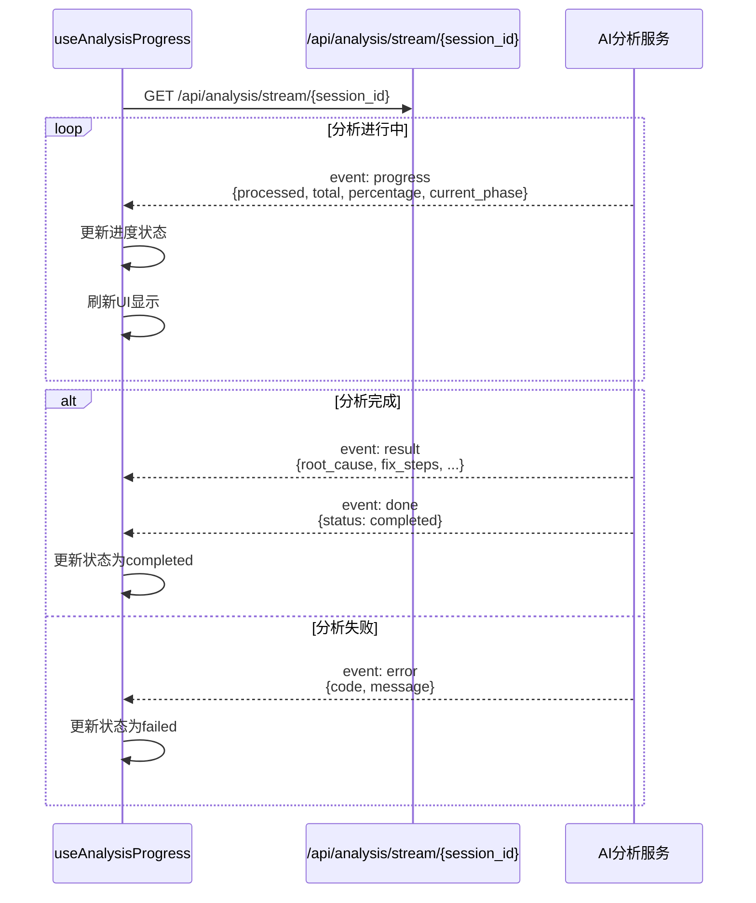
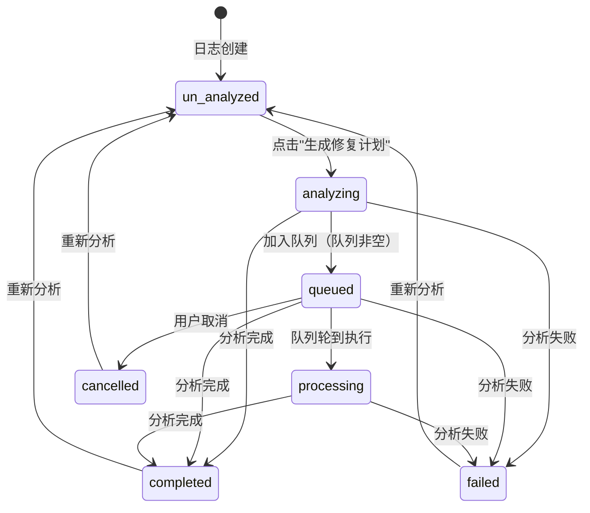
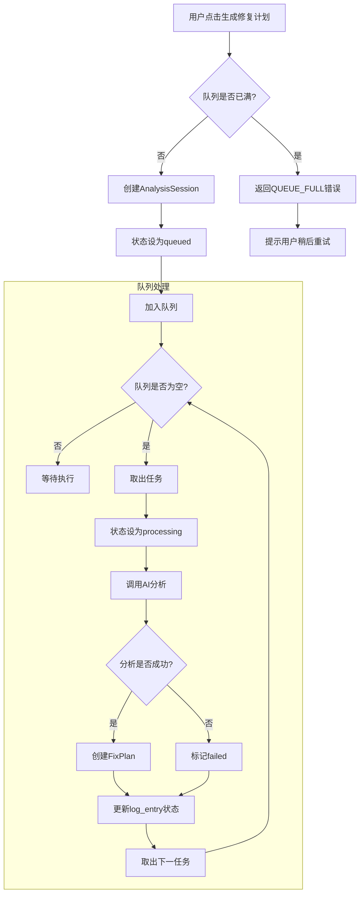

# Flow: 错误日志修复计划状态

**Branch**: `007-error-log-analysis-status` | **Date**: 2026-04-14

## 代码执行流程图

### 用户点击"生成修复计划"按钮



### SSE进度监听流程



### 分析状态转换



### 队列状态管理



## 关键函数调用链

### 后端

```
POST /api/analysis/start
  └─> check_repository()
  └─> analysis_queue.enqueue()
        └─> db.create(AnalysisSession)
  └─> return {session_id, status, queue_position}

GET /api/analysis/status/{log_entry_id}
  └─> db.query(LogEntry, analysis_status)
  └─> db.query(AnalysisSession, status, queue_position)
  └─> return {analysis_status, session_id, queue_position, progress_percent}

GET /api/analysis/fix-plan/{log_entry_id}
  └─> db.query(FixPlan, log_entry_id)
  └─> return FixPlan or 404

POST /api/analysis/cancel/{log_entry_id}
  └─> db.query(AnalysisSession, queued, log_entry_id)
  └─> update status=cancelled
  └─> return {cancelled}

GET /api/analysis/stream/{session_id}
  └─> SSE stream
        ├─> progress: 定期推送进度
        ├─> result: 修复计划结果
        ├─> error: 错误信息
        └─> done: 完成状态
```

### 前端

```
useAnalysisProgress
  ├─> startAnalysis(log_entry_id): 调用start API
  ├─> getStatus(log_entry_id): 轮询状态
  └─> subscribeStream(session_id): SSE订阅

useAnalysisQueue
  ├─> enqueue(log_entry_id): 添加到队列状态
  ├─> dequeue(): 从队列移除
  └─> getQueuePosition(): 获取位置

LogList
  ├─> 显示analysis_status标签
  ├─> 根据状态显示不同按钮
  └─> 点击按钮调用对应action
```
